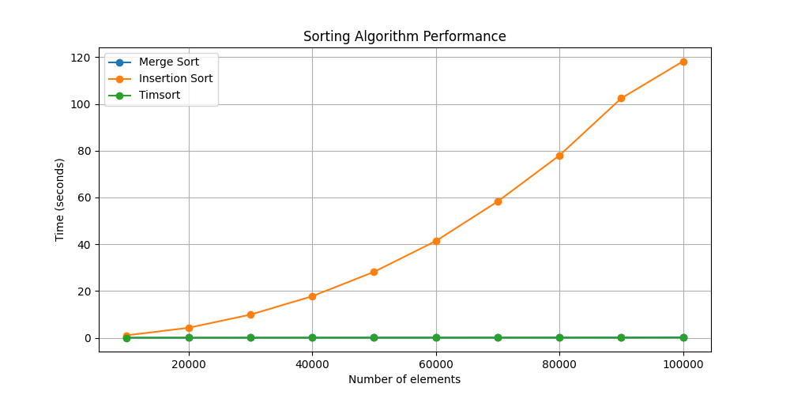

##### Принцип замірів:

Кожен алгоритм тестується на копії одного і того самого "перемішаного" масиву.
Таким чином, порівняння виконується на одному і тому самому випадку.

#### Порівняння ефективності алгоритмів на маленьких масивах

Було виконано заміри часу виконання сортуваня на массивах розмірів від 100 до 1000 з кроком 100.


З графіку видно, що час виконання сортування вставками стрімко зростає вверх, що відразу показує неефективність простого алгоритму вставками.

#### Порівняння ефективності алгоритмів масивах від 10000 до 100000
Алгоритм вставками псує загальну картину графіку так, що час merge sort наклався на timsort. 



З лістінгу виводу консолі видно, що час виконання алгоритму вставками на порядки вище, ніж у двох інших.

```shell
Merge Sort: 10000 elements - 0.014912261998688336 seconds
Insertion Sort: 10000 elements - 1.0119695969988243 seconds
Timsort: 10000 elements - 0.0008681830004206859 seconds
Merge Sort: 20000 elements - 0.028204948001075536 seconds
Insertion Sort: 20000 elements - 4.237559283996234 seconds
Timsort: 20000 elements - 0.002075753000099212 seconds
Merge Sort: 30000 elements - 0.0443811579971225 seconds
Insertion Sort: 30000 elements - 9.863234833006572 seconds
Timsort: 30000 elements - 0.003424598995479755 seconds
Merge Sort: 40000 elements - 0.06483582199871307 seconds
Insertion Sort: 40000 elements - 17.73065758500161 seconds
Timsort: 40000 elements - 0.004578038999170531 seconds
Merge Sort: 50000 elements - 0.08292078699741978 seconds
Insertion Sort: 50000 elements - 28.155316557000333 seconds
Timsort: 50000 elements - 0.005865079001523554 seconds
Merge Sort: 60000 elements - 0.09344676699402044 seconds
Insertion Sort: 60000 elements - 41.344061789997795 seconds
Timsort: 60000 elements - 0.007347746002778877 seconds
Merge Sort: 70000 elements - 0.11092086999997264 seconds
Insertion Sort: 70000 elements - 58.274297547999595 seconds
Timsort: 70000 elements - 0.008841344999382272 seconds
Merge Sort: 80000 elements - 0.12447614999837242 seconds
Insertion Sort: 80000 elements - 77.97457566099911 seconds
Timsort: 80000 elements - 0.01085946799867088 seconds
Merge Sort: 90000 elements - 0.1478594849977526 seconds
Insertion Sort: 90000 elements - 102.43241171500267 seconds
Timsort: 90000 elements - 0.014216678995580878 seconds
Merge Sort: 100000 elements - 0.19814857200253755 seconds
Insertion Sort: 100000 elements - 118.26679306900041 seconds
Timsort: 100000 elements - 0.014082816000154708 seconds
```

Для детальнішого порівняння, виконано порівняння без врахуваннян алгоритму вставками:


З порівняння випливає:
- Сортування вставками: алгоритм показує нормальну швидкість на дуже невеликих масивах, але його швидкість різко знижується при збільшенні розміру масиву. Як видно з результатів, час виконання сортування вставками росте квадратично відносно кількості елементів, що підтверджує його теоретичну оцінку складності O(n^2)
- Сортування злиттям: Сортування злиттям має значно менший час виконання на великих масивах у порівнянні з сортуванням вставками, що відповідає його теоретичній оцінці складності O(n log n). Проте навіть сортування злиттям виявляється значно повільніше Timsort на великих даних.
- Timsort: алгоритм показав найкращі результати на всіх тестових масивах. Timsort є оптимізованою версією сортування злиттям, який включає стратегії сортування вставками для оптимізації роботи з невеликими та частково впорядкованими масивами. Його час виконання залишається вкрай низьким навіть на великих вхідних даних, що відповідає оцінці складності O(n log n) у гіршому випадку.

#### Висновок

Виходячи із замірів часу виконання, можна помітити, що збільшення розміру масиву набагато менше впливає на час виконання Timsort, ніж на інші алгоритми. Для великих наборів даних це робить Timsort найбільш практичним вибором.

Також заміри показують, що вбудований в Python алгоритм сортування (Timsort) є надзвичайно ефективним для практично всіх випадків використання, і це одна з причин, чому програмісти частіше віддають перевагу використанню вбудованих функцій, а не пишуть власні алгоритми для сортування. Це дозволяє економити час на розробці та забезпечити високу швидкість обробки даних без потреби у глибоких знаннях про внутрішні реалізації алгоритмів сортування.

Крім того, реалізації системних бібліотек може містити оптимізації рівня "асемблерний трюк" або робота з регістрами напряму, що завжди робить системну бібліотеку більш вигіднішої для використання.